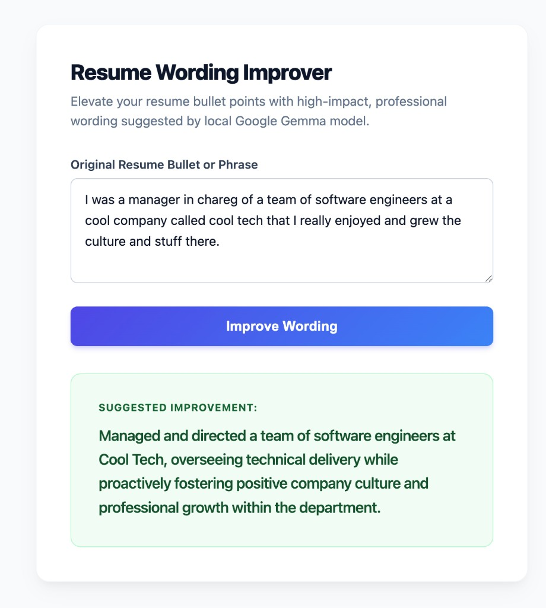

# GemmaPoweredResumeBuilder (Firebase AI Logic)

A hosted resume wording improver built with Angular and [Firebase AI Logic](https://firebase.google.com/docs/ai-logic). Paste a resume bullet, and Gemini rewrites it for tech recruiters without inventing facts, metrics, or technologies.

This repository is the **hosted** workshop fork. The original local version talks to Gemma through Ollama on `localhost:11434`. This version calls Gemini in the cloud from the Angular client, so the same app can run on `ng serve` and on Firebase Hosting.



---

## Key Features

- **Firebase AI Logic**: The Angular app calls Gemini through the Firebase JS SDK. No custom backend and no Gemini API key in the client.
- **Spark-friendly**: Uses the Gemini Developer API free tier. A Blaze (paid) plan is not required for this demo.
- **Factual Integrity**: The model is instructed not to exaggerate, invent, or fabricate experience or metrics.
- **Modern Angular Architecture**: Signal-based state (`signal()`) and built-in template control flow (`@if` / `@else`).
- **Firebase Hosting ready**: Static Angular build with SPA rewrites in `firebase.json`.

---

## How It Works

The Improve Wording button sends the original bullet to Firebase AI Logic (`gemini-flash-latest`) with a system instruction that keeps the rewrite factual. Resume text **leaves the browser** and is processed by Google's Gemini API through your Firebase project.

A Firebase Hosting deploy cannot call Ollama on a laptop. `localhost:11434` is the visitor's machine, not yours, and HTTPS pages cannot reliably talk to a local HTTP LLM. That is why this fork uses AI Logic.

---

## Getting Started

### Prerequisites

1. Install [Node.js](https://nodejs.org/) (v18 or newer recommended).
2. A Google account and a Firebase project on the **Spark** (no-cost) plan.
3. Register a **Web** app in that Firebase project so you have the SDK config object.

### Enable Firebase AI Logic

From this repository (required; skipping this causes `PERMISSION_DENIED`):

```bash
npx -y firebase-tools@latest login
npx -y firebase-tools@latest use YOUR_PROJECT_ID
npx -y firebase-tools@latest init ailogic
```

Choose the **Gemini Developer API**. You do not need Vertex / Agent Platform or a Blaze upgrade for this workshop.

### Installation

```bash
git clone https://github.com/BaronVonPerko/GemmaPoweredResumeBuilder.git
cd GemmaPoweredResumeBuilder
npm install
```

### Add your Firebase web config

Open [src/app/firebase-config.ts](src/app/firebase-config.ts) and replace the `YOUR_*` placeholders with the config from Firebase console -> Project settings -> Your apps.

There is no Gemini API key to paste. AI Logic uses the public Firebase web config.

### Development Server

```bash
npm run start
# or
ng serve
```

Open `http://localhost:4200/`.

### Run Unit Tests

```bash
npm run test
# or
ng test
```

### Production Build

```bash
npm run build
# or
ng build
```

Output is written to `dist/GemmaPoweredResumeBuilder/browser`.

### Deploy to Firebase Hosting

```bash
npm run build
npx -y firebase-tools@latest deploy --only hosting
```

`firebase.json` already points Hosting at that browser output and rewrites unknown routes to `index.html`.

---

## Workspace Specifications (PersonalAISpecs)

This project contains persistent guidelines designed to keep AI assistants in sync with our development workflows. Inside the `PersonalAISpecs/` folder you will find:

- **Workflows/**: Custom pipeline rules for Angular development (`angular-dev-flow.md`) and CI/CD PR babysitting workflows (`github-ci-flow.md`).
- **Behaviors/**: Guidelines for AI logic and verification protocols (`interaction-style.md`).
- **Rules/**: Code hygiene and strict communication boundaries (`angular-and-general-rules.md`).
- **Personalities/**: Customized virtual personas, featuring `jarvis-personality.md` which is polite, formal, and references all specifications.
- **ExternalSkill/**: Built-in context integrating the official [Angular Team Agent Skills](https://angular.dev/ai/agent-skills).

---

## License

This project is licensed under the MIT License.
